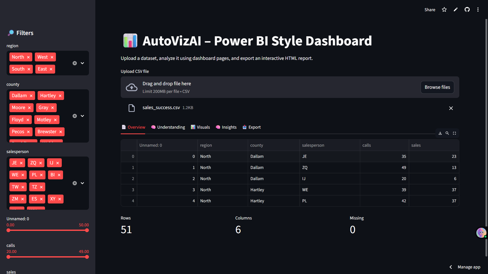
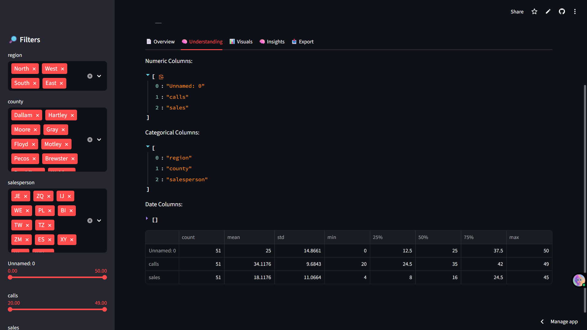

# 📊 AutoVizAI – Power BI Style Automated Data Dashboard

**Live Demo:**  
➡️ https://autovizai-qtgjxxlr4wupm7h3bsj54o.streamlit.app/

**Author:** Rahul  

AutoVizAI is a Streamlit-powered intelligent data analytics dashboard that automatically analyzes any uploaded CSV dataset and builds:

- 🔎 Smart Dataset Understanding  
- 📈 Auto-generated Visualizations  
- ⚡ Power BI–Style Interactive Filters  
- 🧠 AI-like Insights  
- 📥 Downloadable Interactive HTML Report  
- 🧩 Multi-page Dashboard (Tabs)

No manual coding required — just upload a dataset and explore.

---

## 🚀 Features

### ⭐ 1. Power BI-Style Interactive Filters
- Auto-detected filter widgets for categorical, numeric, and date columns  
- Multi-select filters for categories  
- Range sliders for numeric columns  
- Date range selector for date columns  
- All pages update dynamically based on applied filters  

---

### ⭐ 2. Automated Dataset Understanding
AutoVizAI automatically identifies:

- 🔢 Numeric columns  
- 🏷️ Categorical columns  
- 📅 Date columns  
- ❗ Missing values  
- 📊 Statistical summary (mean, std, quartiles)  

---

### ⭐ 3. Automated Visualizations
With zero configuration, the app generates:

- Histograms for numeric distributions  
- Bar charts for categorical features  
- Supports large datasets without lag  
- All charts are interactive (Plotly)  

---

### ⭐ 4. AI-Generated Insights
The app generates human-readable insights such as:

- Dataset size summary  
- Missing value detection  
- Key numeric stats (mean/min/max)  
- Frequent category values  

---

### ⭐ 5. Export Fully Interactive HTML Report
Download an HTML file containing:

- Dataset preview  
- Understanding summary  
- Statistical tables  
- Auto-generated insights  
- All visualizations (Plotly interactive charts)

Perfect for sharing reports with clients, instructors, or employers.

---

### ⭐ 6. Multi-Page Dashboard (Tabs)
Just like Power BI, the app includes:

- **Overview**  
- **Understanding**  
- **Visuals**  
- **Insights**  
- **Export**

Each page updates automatically when filters change.

---

## 🛠️ Tech Stack

| Layer | Technologies |
|-------|--------------|
| Frontend UI | Streamlit |
| Data Engine | Pandas |
| Charts | Plotly Express |
| Export | Custom HTML templating |
| Deployment | Streamlit Cloud |

---

## 📷 Screenshots

(Add your screenshots here in your GitHub repo)

Example:

| Overview Page | Understanding page |
|---------------|--------------------|
|  |  | 

---

